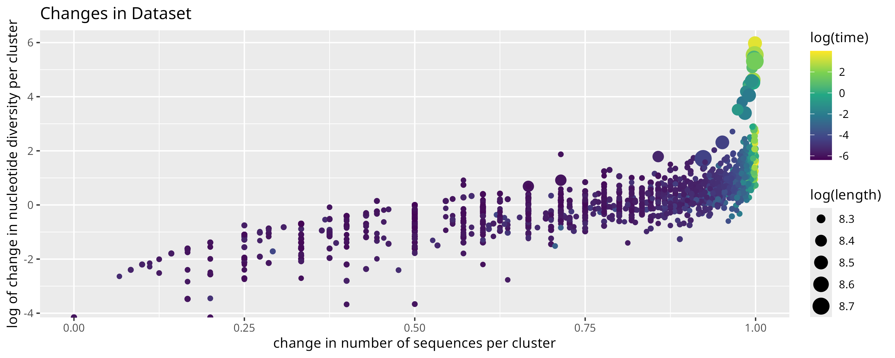
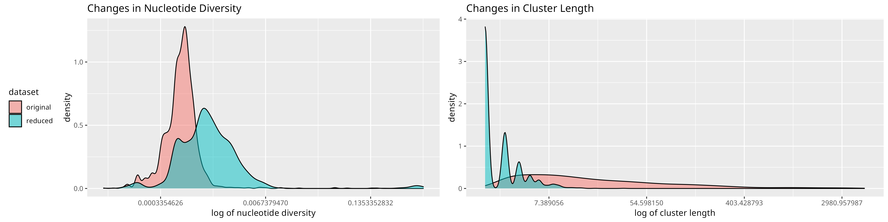
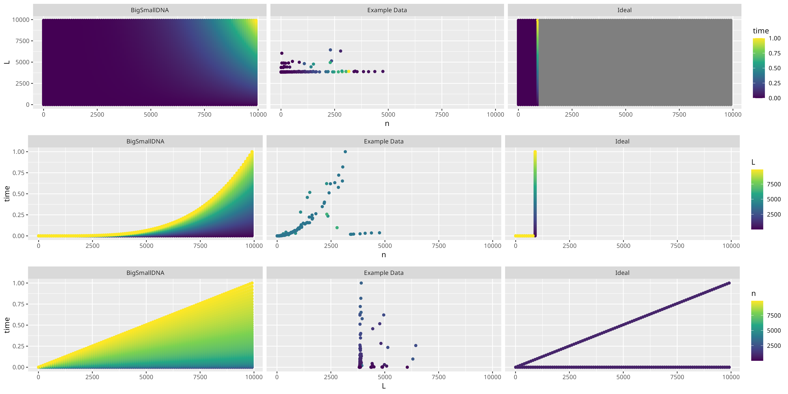

# BigSmallDNA

Reduce large DNA dataset without sacrificing data of significance

---

Its better to read the [pdf version](READMe/READMe.pdf), github isn't rendering some of the LaTeX properly.

# Overview

For studies with DNA datasets, big data is good but computationally expensive. This method aims to reduce it without losing the benefits. It does this by improving the nucleotide diversity of the sample.

An example is provided which uses SARS-CoV-2 virus (responsible for 2019 pandemic and has >9M seqs on GenBank) to show how to implement this method and how good it is.

The provided code is in R and the example uses some command line tools (datasets, SeqKit, EMBOSS, MAFFT), but the method can be implemented in any language.

# Motivation

According to the central limit theorem, larger and larger datasets approximate the normal distribution better, and biological data such as DNA sequences are no different. That is to say that majority of the sequences correspond to similar properties while a minority of the sequences correspond to dissimilar properties found on the extreme end of the distribution. However, given that the population of different species can vary between a few hundred to several trillions, it becomes difficult to study the entire distribution. Hence the focus of big data in bioinformatics is to "capture" the extreme ends of the distribution by sequencing more and more samples. And with over 3.7 billion nucleotide sequences hosted by GenBank in 2024, big data has facilitated the development of numerous fields, such as evolutionary biology, molecular biology, metagenomics, medicine, and forensic investigations. However, it has several caveats which limits its usage by the average researcher.

As big data becomes bigger, so does the computational power and storage requirements; which the average researcher may not have access to, and hence restricts their contributions to their fields. Hence a big focus of research is on making research with big data accessible; whether it by developing better and cheaper hardware, or  developing softwares with better time complexities. However, a point of focus which often goes unseen is the data itself: that is to reduce the dataset in such a manner that data of significance (i.e. corresponding to extreme ends of normal distribution) is not lost.

While there are some methods available for this purpose, the most simplistic is perhaps to improve the nucleotide diversity of the sample. In addition to making the analysis computationally feasible, improving the diversity can change the corresponding distribution from normal to uniform. In normal distributions, there is chance of data of significance resembling and being regarded as random noise, but this chance is significantly reduced in a uniform distribution.

# Method

Overview: For a set of sequences, determine a distance matrix and then determine the nucleotide diversity of those sequences whose distance is greater than some proportion of the maximum distance. The unaligned sequences corresponding to the set of sequences with the maximum diversity comprise the reduced dataset.

Let $X$ be a set of *aligned* sequences with no duplicates, then construct a distance matrix $D$ using an appropriate model (consult literature), e.g. JC69, K80, F81, TN93 etc.

Using the maximum distance ($m = \max(D)$) and $T \subseteq [0,1]$, determine the thresholds $t$, i.e.
$$t \in m \cdot T$$
$T$ will depend on how closely related are the sequences.
If you are sure, then use a narrower range, e.g. $T = \{0.9, 0.95, 0.999, 1\}$.
If you are unsure, then use a wider range, i.e. $T = \{0.5, 0.6, 0.7, 0.8, 0.9, 1\}$.

Then, $\forall t \in m \cdot T$, determine a corresponding set $S_t$ such that it contains those sequences whose distance ($d_{ij}$) is greater than $t$, i.e.
$$S_t = \{ m_i,m_j \in X: d_{ij} \geq t\}$$
Determine Nei's nucleotide diversity for all of these sets, i.e. $\pi(S_t)$. Then $\max(\{\pi(S_t): t \in m \cdot T\})$ is our desired set and the corresponding *unaligned* sequences comprise the reduced set $X'$.

It is recommended to cluster sequences and then improving the diversity for all clusters. Sequences can be clustered using existing classifications (e.g. Pangolin for SARS-CoV-2) or clustering softwares such as MeShClust, MMseqs etc. Since both distance matrix and nucleotide diversity computations are $O(L \cdot n^2)$, with $n$ being the number of sequences and $L$ being the length of a sequence, clustering can reduce computational time.

It is also recommended to focus on smaller sequences rather than longer sequences, e.g. focusing on individual genes rather than the whole genome. This is because it can reduce $L$ as well as $n$ since distinct genomes need not have distinct genes.

# Example

See "Example/ExamplePipeline.Rmd" for details.

The original dataset comprised of 183,780 sequences of length ~4kb. The data was divided into 1849 clusters. The improvements are shown below in the Table 1 and Figure 1 while Figure 2 shows the changes in the distributions of nucleotide diversity and number of sequences.

|Property|Original Dataset|Reduced Dataset|Change (%)|
|--:|:-:|:-:|:-:|
|mean $\pi$ per cluster|0.0009177|0.0074139|708|
|min $\pi$ per cluster|0.0000000|0.0000000|0|
|max $\pi$ per cluster|0.1621207|0.6161369|280|
|------------------------------|------------------------|------------------------|------------------------|
|mean seqs per cluster|99|3|3200|
|min seqs per cluster|3|2|50|
|max seqs per cluster|4,749|34|13,868|
|------------------------------|------------------------|------------------------|------------------------|
|Total number of seqs|183,780|6,673|2,654|

# Efficiency

Consider a set of aligned sequences $X$ such that $|X| = n$ and each sequence is of length $L$.

Nei's nucleotide diversity is calculated by determining the number of nucleotide differences for all pairs of sequences and normalizing the average difference by the sequence length. Since it performs $\frac{n(n-1)}{2}$ calculations with each calculation comparing sequences of length $L$, its time complexity is $O(L \cdot n^2)$.

The ideal method to maximize $\pi$ is to determine $\max(\{\pi(x):x \in P(X)\})$, i.e. determine $\pi$ for all subsets of $X$ and then determine the max $\pi$. But since $\pi$ is calculated $|P(X)|$ times¹, the time complexity becomes
$$O(L \cdot n^2 \cdot 2^n)$$

¹ $P(X)$ has $2^x$ elements but $x$ elements are singletons and 1 element is null set for which $\pi$ can not be calculated, hence the number of calculations is $2^x-x-1$ but since lower order terms are ignored in time complexity, only $2^x$ is considered.

Our approach relies on constructing a distance matrix and then determining $\pi$, $|T|$ times. We use the function dist.dna from ape package of R to construct the distance matrix which has a time complexity of $O(L \cdot n^2)$. Ignoring minute operations (e.g. comparing distances with threshold, determining maximum distance), the time complexity becomes $O(L \cdot n^2 \cdot |T| \cdot n^2)$ and since $|T|$ is typically 4-5, therefore
$$O(4L \cdot n^4)$$

Although its not amazing, our method is much faster than the ideal approach. Figure 3 shows the comparison between the two methods as well as the actual data from the Example. Observe that in the ideal approach, after around $x=1000$, no values have been computed. This is because the values were so large that R computed them as infinity. Hence, the recommendation for extracting specific regions to reduce $L$ and $n$ are further emphasized.

In the example data, the clusters with less than 4k sequences seem to follow the proposed method, while the remaining clusters do not, but it is not clear why this is the case. It might be due to some threshold effect which causes some function to change algorithms depending on the data size, but we were unable to find such effects. Regardless, the example data suggests that the proposed method is more efficient than proposed.
